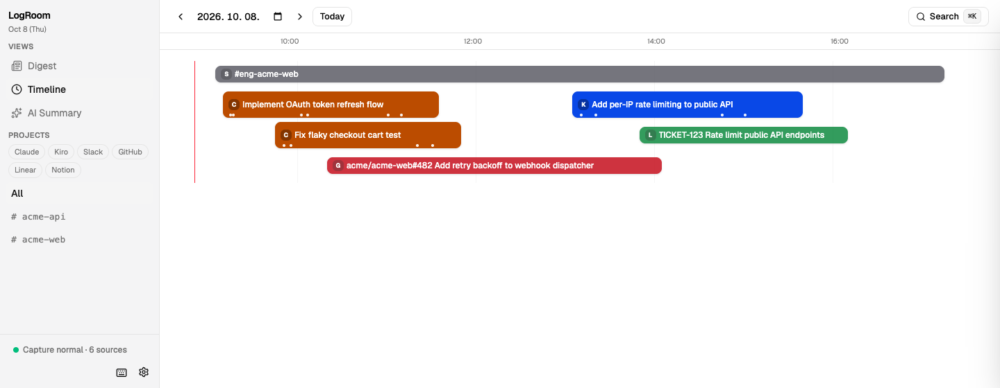
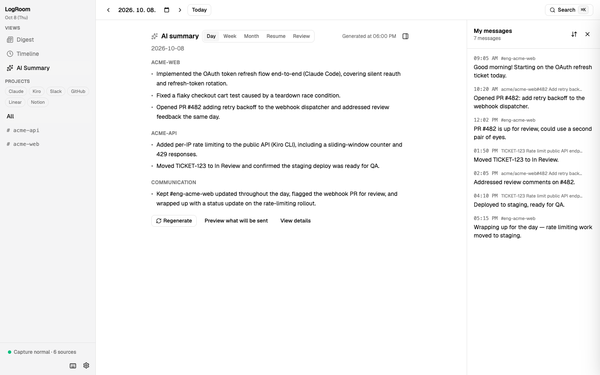

# LogRoom

Privacy-first local activity logger for parallel AI work.

LogRoom collects your Claude Code and Kiro sessions together with GitHub, Slack, Linear and Notion activity, shows them as parallel lanes on one timeline, and writes daily, weekly and monthly AI summaries.




## Features

- **Local only** — data stays in a SQLite file on your Mac. No account, no telemetry. Network calls go only to the connectors and summary engine you enable, plus an update check you can turn off.
- **Parallel lanes** — each agent session, PR or ticket gets its own lane, so concurrent work stays readable.
- **Per-repo splitting** — sessions started outside a repository (for example by an orchestrating agent) are split by the repositories they actually touched.
- **AI summaries with your own tools** — summaries run through a CLI you already use (Claude Code, Gemini CLI, Codex) or your own API key. You can preview the excerpt before anything is sent.
- **Secret scrubbing** — known secret patterns are redacted before storage.

## Install

Apple Silicon (M1 or later) only. The app is not notarized.

- Homebrew: `brew install --cask yootaebong/tap/logroom`
- DMG: <https://releases.logroom.app/latest/LogRoom.dmg>

On first launch macOS may block the app. Open **System Settings → Privacy & Security** and click **Open Anyway**.

## Build from source

Requirements: Node.js 20+, pnpm 10 (see `packageManager` in `package.json`), a recent stable Rust toolchain, Xcode Command Line Tools.

```sh
pnpm install
pnpm --filter @logroom/core build
pnpm --filter @logroom/desktop tauri dev     # run
pnpm --filter @logroom/desktop tauri build   # build the app bundle
```

More in [apps/desktop/README.md](apps/desktop/README.md).

## Privacy

See [docs/04-privacy-security.md](docs/04-privacy-security.md).

## Documentation

Design notes (Korean): [docs/README.md](docs/README.md).

## Contributing

See [CONTRIBUTING.md](CONTRIBUTING.md).

## License

[MIT](LICENSE)

## 한국어

LogRoom 은 병렬 AI 작업을 위한 로컬 전용 활동 기록기입니다. Claude Code·Kiro 세션과 GitHub·Slack·Linear·Notion 활동을 모아 병렬 타임라인으로 보여 주고, 일·주·월 AI 요약을 만듭니다.

- **로컬 전용** — 데이터는 내 Mac 의 SQLite 파일에만 저장됩니다. 계정·텔레메트리 없음. 네트워크 요청은 켠 커넥터·요약 엔진과 업데이트 확인(끌 수 있음)뿐입니다.
- **병렬 레인** — 에이전트 세션·PR·티켓마다 레인이 따로 생겨 동시에 한 일이 섞이지 않습니다.
- **레포별 분할** — 레포 밖에서 시작한 세션(중간 에이전트 등)을 실제로 만진 레포별로 나눕니다.
- **AI 요약은 내 도구로** — 이미 쓰는 CLI(Claude Code·Gemini CLI·Codex)나 내 API 키로 요약합니다. 보내기 전에 발췌를 미리 볼 수 있습니다.

설치: Apple Silicon 전용, 공증되지 않은 앱입니다. `brew install --cask yootaebong/tap/logroom` 또는 [DMG](https://releases.logroom.app/latest/LogRoom.dmg). 첫 실행이 막히면 **시스템 설정 → 개인정보 보호 및 보안 → 그래도 열기**를 누르세요.

소스 빌드·문서·기여·라이선스는 위 영어 절을 참고하세요.
